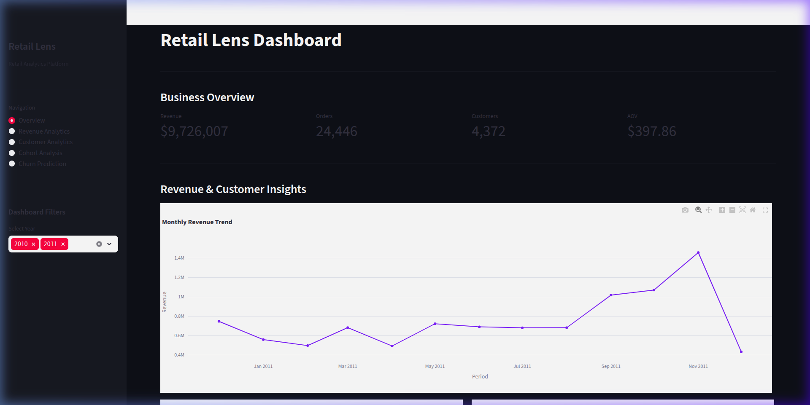
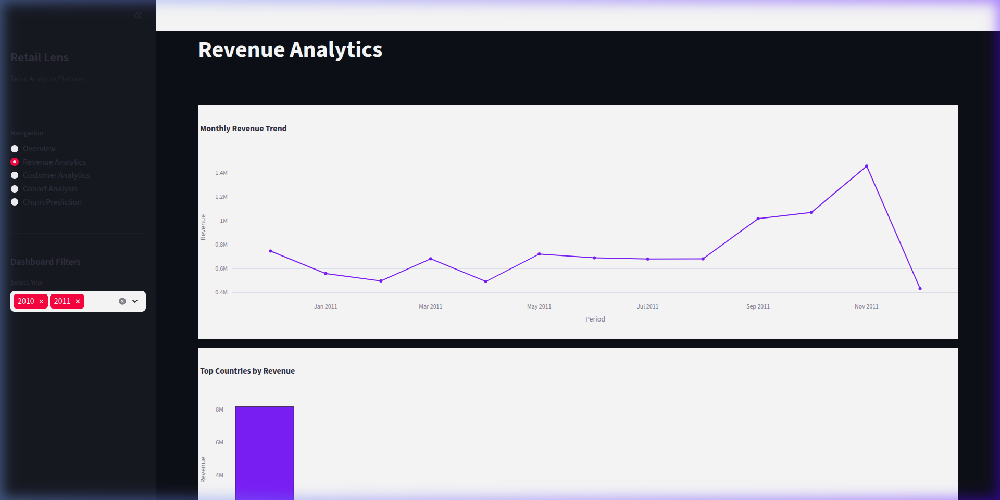
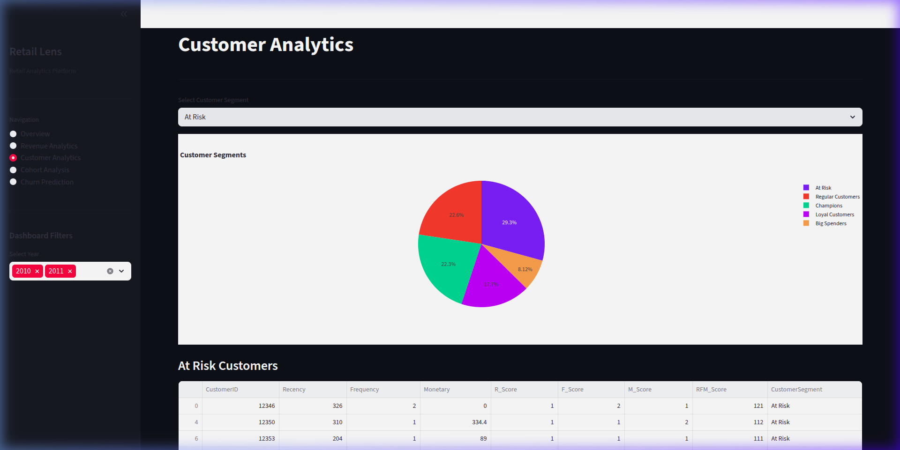
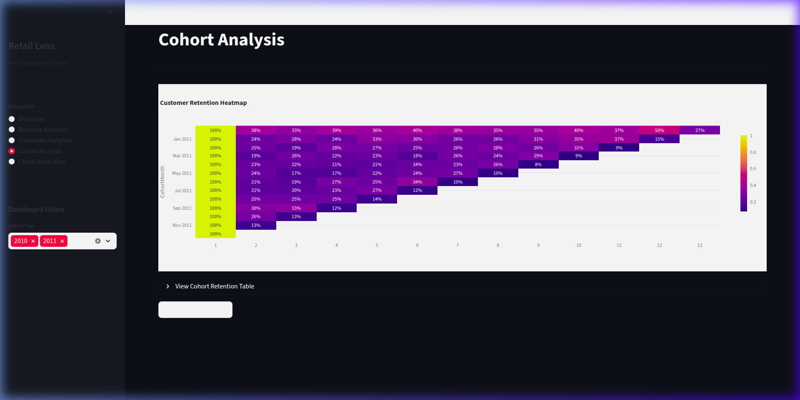
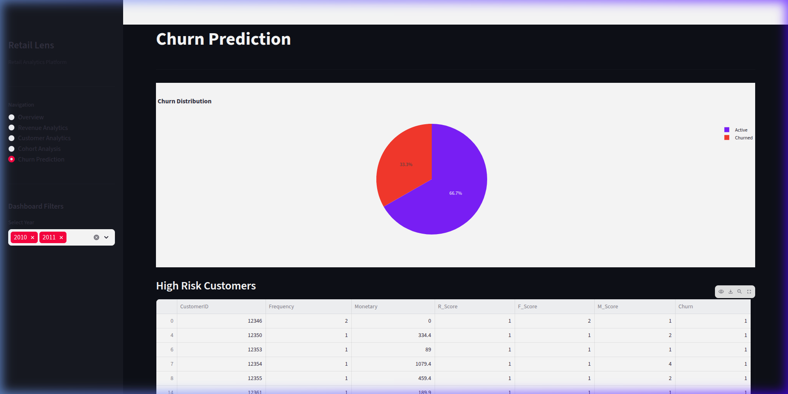

# 📊 Retail Lens

**Retail Lens** is an end-to-end retail analytics and customer intelligence platform built with Python, SQL, Machine Learning, and Streamlit. It transforms raw transactional e-commerce data into actionable business insights through a complete data pipeline — from ETL and SQL analytics to predictive ML modeling and interactive BI dashboards.

> 🏪 **Dataset:** UCI Online Retail Dataset — 500K+ real-world e-commerce transactions (2010–2011)

---

## 🚀 Live Demo

Run locally in 3 commands:

```bash
git clone <repository-url> && cd retail-lens
python -m venv venv && source venv/bin/activate && pip install -r requirements.txt
python -m streamlit run src/dashboard/app.py
```

---

## 📸 Dashboard Screenshots

### Overview Dashboard
KPI cards (Revenue, Orders, Customers, AOV), monthly revenue trend, country breakdowns, and customer segment distribution.



---

### Revenue Analytics
Monthly revenue trend line chart, top-10 countries by revenue bar chart, and downloadable revenue dataset.



---

### Customer Analytics
RFM-based customer segment pie chart, segment-filtered data table, and per-segment metrics (count, average monetary value).



---

### Cohort Analysis
Monthly cohort retention heatmap and cohort revenue analysis tracking customer behavior over time.



---

### Churn Prediction
Churn distribution pie chart, high-risk customer table, estimated churn rate metric, and CSV export of at-risk customers.



---

## 🏗️ Architecture Overview

```
Raw CSV Data (500K+ rows)
        │
        ▼
┌───────────────┐
│   ETL Module  │  clean_data.py — dedup, validation, feature engineering
└───────┬───────┘
        │ cleaned_retail.csv
        ▼
┌───────────────┐
│  SQL Engine   │  SQLite database via database_setup.py
└───────┬───────┘
        │ retail.db
        ▼
┌────────────────────────────────────┐
│         Analytics Modules          │
│  ├── RFM Analysis (rfm.py)         │
│  ├── Customer Segmentation         │
│  ├── Cohort Analysis               │
│  └── SQL Queries (queries.py)      │
└───────┬────────────────────────────┘
        │ processed CSVs + DB
        ▼
┌───────────────┐
│  ML Pipeline  │  churn_dataset.py → churn_model.py → experiments/
└───────┬───────┘
        │
        ▼
┌───────────────┐
│  Streamlit    │  5-page interactive dashboard with filters + exports
│  Dashboard    │
└───────────────┘
```

---

## ✨ Features

### 📈 Retail Analytics
| Feature | Description |
|---|---|
| Revenue Trend | Monthly revenue line chart over 2010–2011 |
| Country Analytics | Top-10 countries by revenue (bar chart) |
| Product Performance | Top products by quantity sold and revenue |
| KPI Reporting | Revenue, Orders, Customers, AOV |

### 👥 Customer Intelligence
| Feature | Description |
|---|---|
| RFM Scoring | Recency, Frequency, Monetary scoring (1–5 scale, quintile bins) |
| Segmentation | 6 segments: Champions, Loyal, Big Spenders, At Risk, Lost, Regular |
| Behavioral Analytics | Spending patterns, order frequency, average values |
| Retention Analysis | Customer retention by segment |

### 🔄 Cohort Analysis
| Feature | Description |
|---|---|
| Monthly Cohorts | Group customers by first purchase month |
| Retention Heatmap | Visualize retention % across cohort months |
| Cohort Revenue | Average revenue per cohort over time |
| Cohort Sizing | Track cohort growth and decay |

### 🤖 Machine Learning — Churn Prediction
| Feature | Description |
|---|---|
| Churn Definition | Customer inactive > 90 days = churned |
| Baseline Model | Logistic Regression with Standard Scaling |
| Experiment 1 | Logistic Regression without data leakage (R_Score excluded) |
| Experiment 2 | Random Forest Classifier (100 estimators) |
| Evaluation | Accuracy, Precision, Recall, F1, Confusion Matrix, Feature Importance |

### 📊 Interactive Dashboard
| Feature | Description |
|---|---|
| 5 Pages | Overview, Revenue, Customers, Cohort, Churn |
| Year Filter | Sidebar multiselect filter (2010, 2011) |
| Segment Filter | Dropdown segment explorer on Customer page |
| Downloadable Reports | CSV export on Revenue and Churn pages |
| Dark Mode | Plotly dark theme throughout |

---

## 🛠️ Tech Stack

| Category | Tools |
|---|---|
| Language | Python 3 |
| Data Analysis | Pandas 3.0, NumPy 2.4 |
| Database | SQLite (via sqlite3) |
| Visualization | Plotly 6.3, Matplotlib 3.10, Seaborn 0.13 |
| Machine Learning | Scikit-learn 1.8 |
| Dashboard | Streamlit 1.57 |
| Notebooks | Jupyter |

---

## 📁 Project Structure

```
retail-lens/
│
├── data/
│   ├── raw/                    # Original UCI dataset (data.csv, ~45MB)
│   ├── processed/              # cleaned_retail.csv, retail.db, rfm_table.csv,
│   │                           # rfm_segments.csv, cohort_retention.csv,
│   │                           # cohort_sizes.csv, customer_churn_dataset.csv
│   └── exports/                # Downloaded reports
│
├── notebooks/
│   └── 01_dataset_understanding.ipynb  # EDA and exploration
│
├── src/
│   ├── etl/
│   │   └── clean_data.py              # Full ETL pipeline
│   │
│   ├── analytics/
│   │   ├── database_setup.py          # CSV → SQLite loader
│   │   ├── queries.py                 # SQL query library (25+ queries)
│   │   └── test_queries.py            # Query validation
│   │
│   ├── customer_analytics/
│   │   ├── rfm.py                     # RFM calculation + scoring
│   │   └── segmentation.py            # 6-segment RFM classification
│   │
│   ├── cohort_analysis/
│   │   ├── cohort.py                  # Full cohort pipeline
│   │   └── utils.py                   # Data loaders and savers
│   │
│   ├── ml/
│   │   ├── baseline/
│   │   │   ├── churn_dataset.py       # Churn label creation from RFM
│   │   │   ├── churn_model.py         # Logistic Regression baseline
│   │   │   └── evaluation.py          # Metrics + confusion matrix
│   │   ├── experiments/
│   │   │   ├── logistic_no_leakage.py # Logistic Regression (no leakage)
│   │   │   ├── random_forest.py       # Random Forest experiment
│   │   │   └── roc_analysis.py        # ROC-AUC evaluation
│   │   └── utils.py                   # Path utilities
│   │
│   ├── visualization/
│   │   └── (visualization utilities)
│   │
│   └── dashboard/
│       ├── app.py                     # Streamlit entrypoint + routing
│       ├── styles.py                  # Global CSS styling
│       ├── utils.py                   # Cached data loaders
│       ├── components/
│       │   ├── sidebar.py             # Navigation + year filter
│       │   ├── charts.py              # Reusable Plotly charts (5 charts)
│       │   └── metrics.py             # KPI card renderer
│       └── views/
│           ├── overview.py            # Overview page
│           ├── revenue.py             # Revenue Analytics page
│           ├── customers.py           # Customer Analytics page
│           ├── cohort.py              # Cohort Analysis page
│           └── churn.py               # Churn Prediction page
│
├── models/                     # Saved ML model artifacts
├── docs/
│   └── screenshots/            # Dashboard screenshots
│
├── requirements.txt
├── README.md
└── PROJECT_STRUCTURE.md
```

---

## ⚙️ Installation & Setup

### 1. Clone Repository
```bash
git clone <repository-url>
cd retail-lens
```

### 2. Create Virtual Environment
```bash
python -m venv venv
source venv/bin/activate   # Linux/macOS
# venv\Scripts\activate    # Windows
```

### 3. Install Dependencies
```bash
pip install -r requirements.txt
```

### 4. Data Pipeline (First Time Setup)

Run these scripts in order from the project root:

```bash
# Step 1: Clean raw data
python -m src.etl.clean_data

# Step 2: Load into SQLite
python -m src.analytics.database_setup

# Step 3: Compute RFM scores
python -m src.customer_analytics.rfm

# Step 4: Segment customers
python -m src.customer_analytics.segmentation

# Step 5: Build cohorts
python -m src.cohort_analysis.cohort

# Step 6: Build churn dataset
python -m src.ml.baseline.churn_dataset

# Step 7: Train churn model
python -m src.ml.baseline.churn_model
```

### 5. Run Dashboard
```bash
python -m streamlit run src/dashboard/app.py
```

---

## 📊 Dataset

- **Source:** [UCI Machine Learning Repository — Online Retail Dataset](https://archive.ics.uci.edu/ml/datasets/online+retail)
- **Size:** ~500,000 transactions
- **Period:** December 2010 – December 2011
- **Fields:** `InvoiceNo`, `StockCode`, `Description`, `Quantity`, `InvoiceDate`, `UnitPrice`, `CustomerID`, `Country`
- **Coverage:** 38 countries, 4,372 unique customers, 24,446+ orders

---

## 🧹 ETL Pipeline Details

The `clean_data.py` module performs a full data cleaning pipeline:

| Step | Function | Description |
|---|---|---|
| Load | `load_data()` | Reads raw CSV with cp1252 encoding |
| Deduplicate | `remove_duplicates()` | Drops exact duplicate rows |
| Validate | `remove_invalid_rows()` | Removes rows missing Description/Quantity/UnitPrice and zero-quantity rows |
| Standardize | `standardize_datatypes()` | Parses InvoiceDate to datetime |
| Flag | `create_flags()` | Creates IsCancelled, IsReturn, HasCustomerID flags |
| Engineer | `engineer_features()` | Creates Revenue, Year, Month, Day, Hour, Weekday columns |
| Validate | `validate_data()` | Prints shape, nulls, dtypes, revenue stats |
| Save | `save_data()` | Exports cleaned CSV |

---

## 🧮 RFM Model

Customers are scored on three dimensions using quintile binning:

| Dimension | Definition | Score |
|---|---|---|
| **Recency (R)** | Days since last purchase | 5 = most recent, 1 = oldest |
| **Frequency (F)** | Total unique invoices | 5 = most frequent, 1 = least |
| **Monetary (M)** | Total revenue generated | 5 = highest spender, 1 = lowest |

### Segments

| Segment | Criteria |
|---|---|
| **Champions** | R≥4, F≥4, M≥4 |
| **Loyal Customers** | F≥4 |
| **Big Spenders** | M≥4 |
| **Lost Customers** | R=1, F≤2, M≤2 |
| **At Risk** | R≤2 |
| **Regular Customers** | All others |

---

## 🔄 Cohort Analysis

Each customer is assigned to the **cohort of their first purchase month**. The `CohortIndex` tracks how many months have passed since the cohort's first month. This generates a retention matrix showing what % of each cohort returned in subsequent months.

---

## 🤖 ML Experiments

### Baseline — Logistic Regression
- **Features:** Frequency, Monetary, R_Score, F_Score, M_Score
- **Target:** Churn (1 = inactive > 90 days)
- **Split:** 80/20 train/test, random_state=42
- **Scaling:** StandardScaler

### Experiment 1 — Logistic Regression (No Leakage)
- Excludes `R_Score` to prevent temporal data leakage
- **Features:** Frequency, Monetary, F_Score, M_Score

### Experiment 2 — Random Forest
- `RandomForestClassifier(n_estimators=100, random_state=42)`
- **Features:** Frequency, Monetary, F_Score, M_Score
- Feature importance via Gini impurity

---

## 🧠 Skills Demonstrated

- **Data Engineering:** ETL pipeline design, data validation, feature engineering
- **SQL Analytics:** 25+ analytical queries across KPIs, revenue, products, customers
- **Python:** Modular architecture, path management, reusable components
- **Customer Analytics:** RFM modeling, behavioral segmentation
- **Cohort Analysis:** Retention matrix construction, business interpretation
- **Machine Learning:** Binary classification, data leakage awareness, model evaluation
- **Dashboard Engineering:** Multi-page Streamlit app with caching, routing, and exports
- **Data Visualization:** Interactive Plotly charts, heatmaps, pie/bar/line charts

---

## 🔮 Future Improvements

- [ ] PostgreSQL integration for production-scale data
- [ ] Real-time streaming analytics pipeline
- [ ] Advanced ML: XGBoost, LightGBM, model stacking
- [ ] Cloud deployment (AWS / GCP / Heroku)
- [ ] Authentication and multi-user support
- [ ] REST API layer for external integrations
- [ ] Automated retraining pipeline
- [ ] A/B testing analytics module

---

## 📄 License

MIT License — see [LICENSE](LICENSE) for details.

---

*Built with Python · Pandas · SQLite · Scikit-learn · Plotly · Streamlit*
